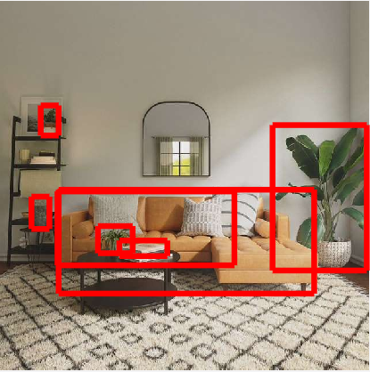

English| [简体中文](./README_cn.md)

# Function Introduction

The `hobot_visualization` package is developed by Horizon Robotics based on Ros2 to convert ai_msgs topic messages into visualization_msgs topic messages for visualizing relevant data.

# Compilation

## Dependency Libraries

ROS packages:

- ai_msgs
- rclcpp
- visualization_msgs

`ai_msgs` is a custom message format defined by Horizon Robotics. It is used to publish inference results after algorithm model inference, and the `ai_msgs` package is defined in `hobot_msgs`.

`rclcpp` is a C++ client library in ROS2 that provides APIs for creating ROS2 nodes, subscribing and publishing topics, invoking services, creating timers, etc.

`visualization_msgs` is a message package in ROS2 used for visualizing and displaying robot-related data.

## Development Environment

- Programming Language: C/C++
- Development Platform: X3/X86
- System Version: Ubuntu 20.04
- Compilation Toolchain: Linux GCC 9.3.0/Linaro GCC 9.3.0

## Compilation

Supports compilation on X3 Ubuntu system and cross-compilation using docker on PC.

### Compilation Options

1. BUILD_HBMEM
   - Enable switch for zero-copy transmission mode. It is enabled by default when cross-compiling with Docker (ON), and can be turned off during compilation by using `-DBUILD_HBMEM=OFF`.
   - By default, the zero-copy transmission mode switch is turned off for compilation on the board side. If zero-copy dependency is needed, it can be enabled by using `-DBUILD_HBMEM=ON`.
   - If enabled, the compilation will depend on the `hbm_img_msgs` package and requires compiling using tros.
   - If disabled, the compilation and execution do not depend on the `hbm_img_msgs` package and support compilation using native ROS and tros.   
   - For zero-copy communication, currently only supports subscribing to images in nv12 format.

### Compilation of X3 Version on Ubuntu System

1. Confirmation of Compilation Environment
   - X3 Ubuntu system is installed on the board.
   - The current compilation terminal has set the TogetheROS environment variable: `source PATH/setup.bash`. Here, PATH is the installation path of TogetheROS.
   - ROS2 compilation tool `colcon` is installed, installation command: `pip install -U colcon-common-extensions`.

2. Compilation
   Compilation command: `colcon build --packages-select hobot_visualization --cmake-args -DBUILD_HBMEM=ON`### Docker Cross Compilation X3 Version

1. Compilation Environment Confirmation

   - Compiling in docker, with TogetheROS already installed in docker. For instructions on docker installation, cross compilation, TogetheROS compilation, and deployment, please refer to the README.md in the robot development platform repo.

2. Compilation

   - Compilation Command:

```shell
export TARGET_ARCH=aarch64
export TARGET_TRIPLE=aarch64-linux-gnu
export CROSS_COMPILE=/usr/bin/$TARGET_TRIPLE-

colcon build --packages-select hobot_visualization \
   --merge-install \
   --cmake-force-configure \
   --cmake-args \
   --no-warn-unused-cli \
   -DCMAKE_TOOLCHAIN_FILE=`pwd`/robot_dev_config/aarch64_toolchainfile.cmake
```

### Compilation of X86 Version on X86 Ubuntu System

1. Compilation Environment Confirmation

   - X86 Ubuntu Version: Ubuntu 20.04

2. Compilation

   - Compilation Command:

   ```shell
   colcon build --packages-select hobot_visualization  \
      --merge-install \
      --cmake-args \
      -DPLATFORM_X86=ON \
      -DBUILD_HBMEM=ON \
      -DTHIRD_PARTY=`pwd`/../sysroot_docker \
   ```

## Notes

# User Guide

## Parameters| Parameter Name          | Type         | Description                                   | Required  | Supported Configurations | Default Value               |
| ---------------------- | ----------- | ------------------------------------------- | -------- | -------------------- | ----------------------------- |
| msg_pub_topic_name  | std::string | Convert imagemarker to | No      | Configured based on actual deployment environment | /hobot_visualization |
| smart_msg_sub_topic_name  | std::string | Topic name for receiving from dnn node | No      | Should be consistent with the corresponding topic name in ai_msgs | /hobot_dnn_detection |

## Running

After successful compilation, copy the generated install folder to the Horizon X3 development board (skip the copying step if compiling on X3), and run the following commands:


### **Ubuntu X3**

```shell
export COLCON_CURRENT_PREFIX=./install
source ./install/setup.bash

# Start visualization node
ros2 run hobot_visualization hobot_visualization

```

### **Ubuntu X3 Launch**

```shell
export COLCON_CURRENT_PREFIX=./install
source ./install/setup.bash

# Start visualization node
ros2 launch hobot_visualization hobot_vis_render.launch.py
```

### **Linux X3**

```shell
export ROS_LOG_DIR=/userdata/
export LD_LIBRARY_PATH=${LD_LIBRARY_PATH}:./install/lib/

# Start visualization node and detection node
./install/lib/hobot_visualization/hobot_visualization
```

## Running on X86 Ubuntu System

```shell
export COLCON_CURRENT_PREFIX=./install
source ./install/setup.bash

ros2 launch hobot_visualization hobot_vis_render.launch.py
```# Result Analysis

## X3 Log Information

```bash
[WARN] [1686109522.331820512] [VisNode]: This is hobot visualization render node!
[WARN] [1686109522.401623519] [hobot_trigger]: Parameter:
 msg_pub_topic_name: /hobot_visualization
 smart_msg_sub_topic_name: /hobot_dnn_detection
[INFO] [1686109522.413797638] [VisNode]: VisNode start.
[INFO] [1686109524.536023791] [VisNode]: smart msg: Recved msg, frame_id: 2233, stamp: 1686109524_471390976, targets size: 1 has roi num: 1 has capture num: 0, roi type: surfboard, roi x1: 1, roi y1: 70, roi x2: 264, roi y2: 215, has attr num: 0

[INFO] [1686109524.573302027] [VisNode]: smart msg: Recved msg, frame_id: 2234, stamp: 1686109524_505037056, targets size: 1 has roi num: 1 has capture num: 0, roi type: surfboard, roi x1: 1, roi y1: 68, roi x2: 264, roi y2: 218, has attr num: 0
```

## Foxglove Effect Display
Under foxglove, the fusion rendering of visualization message and image:
